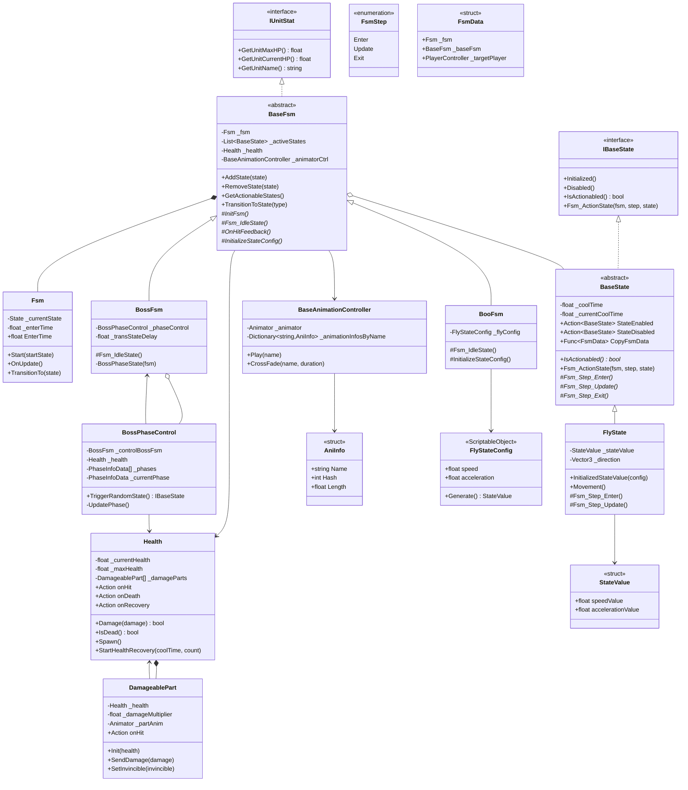

# Unit System for Unity

<div align="center">

🇺🇸 English | [🇰🇷 한국어](./README.ko.md)

</div>

A maintainable and extensible unit system for Unity, designed with interfaces, abstract classes, and ScriptableObjects to make adding and modifying units straightforward.

## Features

- **Class-based FSM**: Encapsulates each state as a dedicated class, reducing MonoBehaviour dependency and making it easy to add or modify states.
- **Decoupled Architecture**: Uses interfaces and inheritance to minimize coupling between systems.
- **Data-Driven Design**: Manages states and status effects via `ScriptableObject` presets for easy tuning without code changes.

---

## Architecture

### 1. State Pattern (FSM)

Each unit's state is controlled through `BaseFsm`. Every FSM state inherits from the `BaseState` class and implements three lifecycle methods:

| Method | Description |
|--------|-------------|
| `Enter()` | Initialization logic when entering the state |
| `Update()` | Per-frame logic (e.g., AI decision-making) |
| `Exit()` | Cleanup logic when leaving the state |

#### 1.1 State Extensibility

States are designed so that you can swap in different ScriptableObject presets for the same state type — making the system highly extensible and well-suited for testing and team collaboration.

**How to use:**
1. Create a ScriptableObject (SO) in the Unity Editor that corresponds to the desired state type.
2. Assign the created SO to the FSM.

> See the `CommonState` folder for detailed examples.

---

### 2. Interaction System

Game interaction elements are modularized for easy modification and extension.

#### 2.1 Body Part Damage System

Damage processing is handled at the `DamageablePart` level. Each part can independently define how much health it reduces, what hit effects play, and what sounds are triggered on impact.

**How to use:**  
Connect `DamageablePart` to a `Health` component — they will automatically synchronize.

#### 2.2 Status Effect System

Status effects run independently and are manageable per unit. Like states (see §1.1), each status effect supports different SO presets, enabling flexible configuration per unit type.

> See the `StatusEffect` folder for the full implementation.

---

### 3. Simplified Animation System

Unity's default animation system requires creating Animator parameters and wiring transitions manually — a cumbersome workflow when structure changes are needed. This architecture allows you to directly select which animation to play from code, without managing Animator variables or transitions.

**How to use:**
1. In the Animator, simply create nodes, name them, and assign the corresponding animation clips — no Transitions or parameters needed.
2. In code, call `Play` or `CrossFade` on `BaseAnimationController` from the desired `BaseState` in your FSM.

> See the `Animation` folder for the full implementation.

---

## Folder Structure

```
Unit-System-for-Unity/
├── Animation/          # Animation controller system
├── CommonState/        # Shared FSM state examples
├── EnemyModule/        # Enemy-specific unit modules
├── Fsm/                # Base FSM and state classes
└── StatusEffect/       # Status effect system
```

---

## Class Diagram


---

## License

This project is licensed under the [MIT License](LICENSE).
